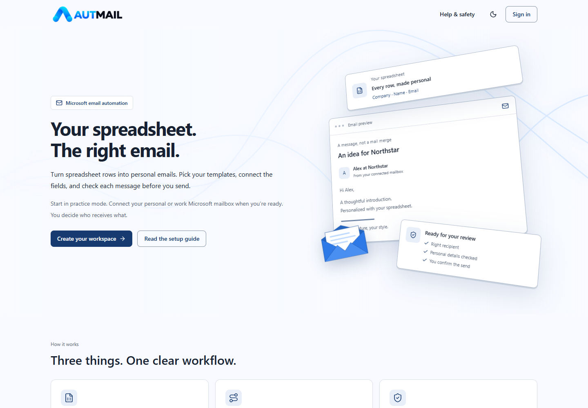
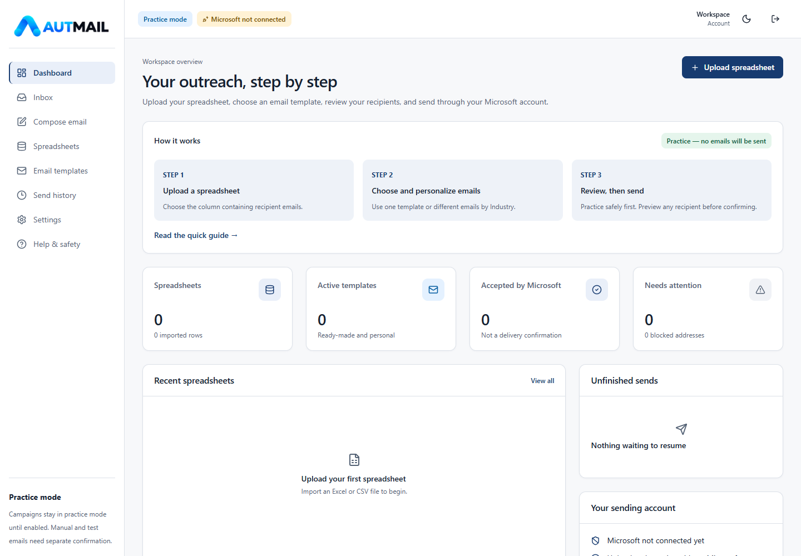
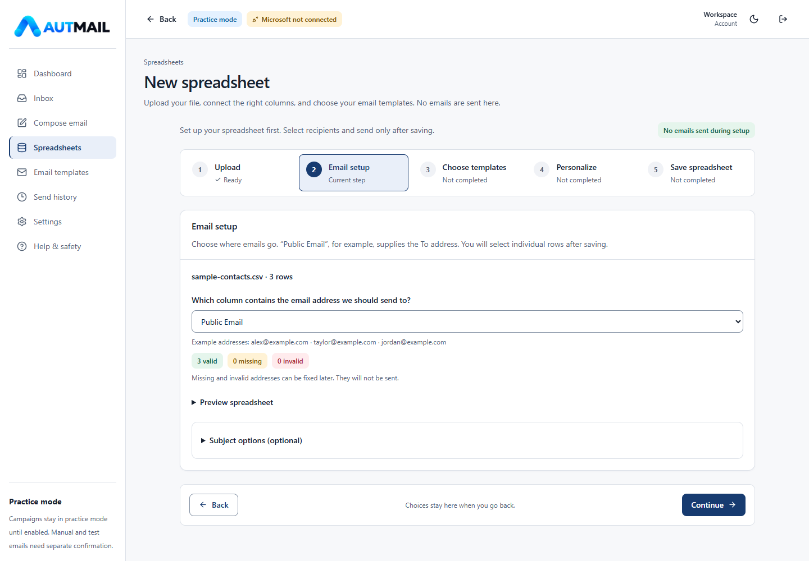
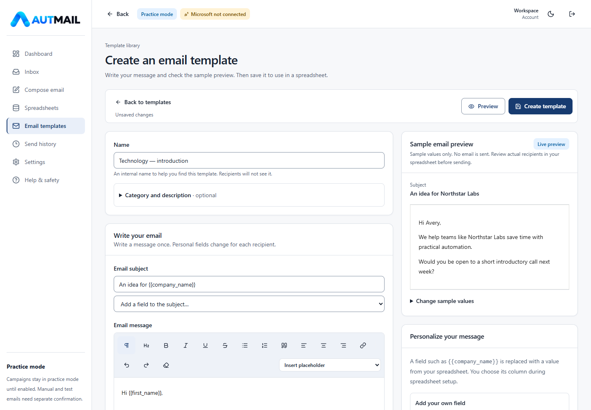
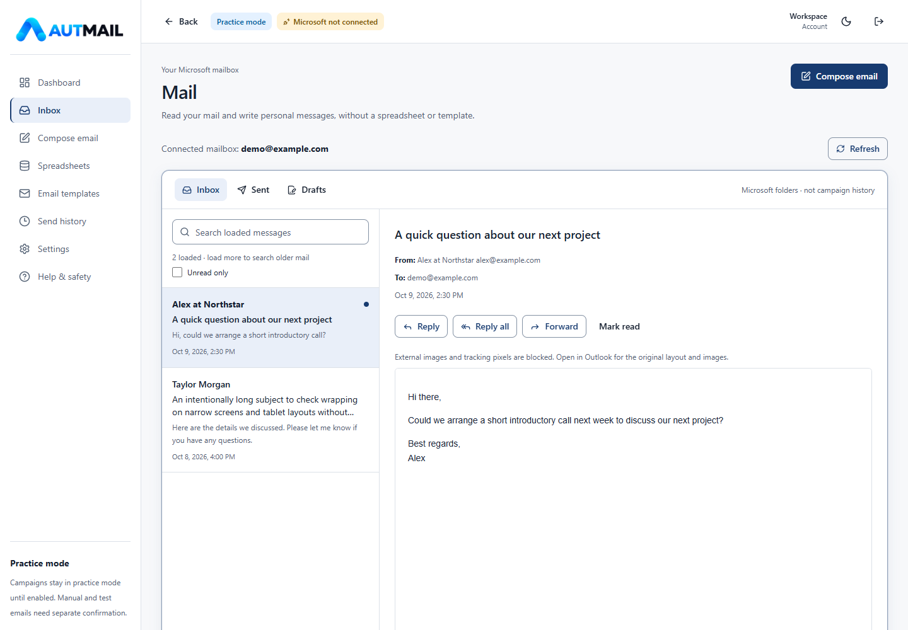
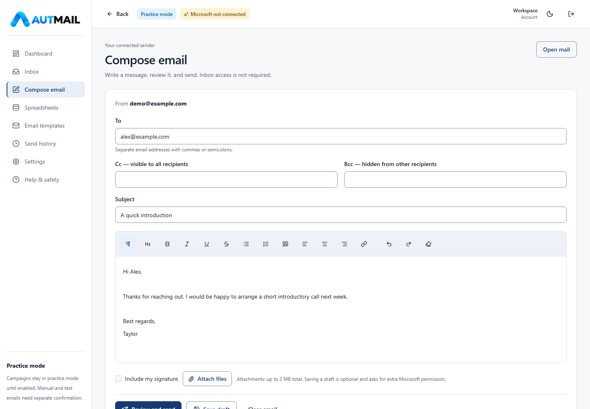

<picture>
  <source media="(prefers-color-scheme: dark)" srcset="src/styles/autmail_black_logo.png">
  
</picture>

# AUTMAIL — Email Automation System

**Turn spreadsheet rows into personal emails, then review and send through your Microsoft mailbox.**

AUTMAIL brings spreadsheet-based outreach, reusable email templates, signatures, and a lightweight mail workspace into one application. It helps teams send individual, personalized messages without repeatedly copying names, company details, and email addresses by hand.

You can also read your **Inbox, Sent, and Drafts** or **compose a single email** without uploading a spreadsheet.

[How it works](#how-it-works) · [Product tour](#product-tour) · [Get started](#get-started) · [Microsoft connection](#microsoft-connection) · [Deployment](#deployment) · [Documentation](#documentation)

<picture>
  <source media="(prefers-color-scheme: dark)" srcset="src/styles/readme/landing-dark.png">
  
</picture>

## What you can do

- **Import Excel or CSV:** select a worksheet, preview your rows, and choose the recipient email column.
- **Choose the right message:** use one template for everyone or match different templates to an Industry or other spreadsheet column.
- **Personalize any supported field:** type `{{company_name}}`, `{{first_name}}`, or your own placeholder and connect it to a column.
- **Build reusable templates:** start from 23 industry templates, make your own copies, and edit, archive, restore, or delete personal templates.
- **Create a flexible signature:** add and reorder text, links, and logos with adjustable image sizes.
- **Review before sending:** select recipients and inspect the actual From, To, subject, message, and missing values.
- **Track campaign results:** inspect saved message snapshots, failures, uncertain outcomes, and recipient exports.
- **Use your mailbox:** read Inbox/Sent/Drafts, reply or forward, save drafts, and compose messages with To/Cc/Bcc and attachments.
- **Manage the application:** configure the shared Microsoft registration in the admin portal; users can choose an allowed personal registration instead.
- **Work comfortably:** responsive phone/tablet/desktop layouts, light/dark themes, keyboard navigation, and in-app help.

### Supported email accounts

Sending uses eligible personal **Outlook.com, Hotmail, Live, or MSN** mailboxes, or **Microsoft 365 work/school** mailboxes. The selected Microsoft registration must allow the account type, and organizational consent rules still apply.

Recipients can use **any email provider**, including Gmail. Connecting a Microsoft identity that uses a Gmail address does not give AUTMAIL access to a Google mailbox; Gmail sending and Gmail inbox integration are not implemented.

## How it works

1. **Upload your spreadsheet.** Choose an Excel/CSV file and, for Excel, the worksheet to use.
2. **Choose where emails go.** Select the column containing recipient email addresses. Check valid, missing, and invalid addresses.
3. **Choose the email templates.** Use one message for all rows, or a column such as Industry to select different messages. Review unmatched or ambiguous values rather than guessing.
4. **Connect personalization fields.** For every placeholder used in the templates, choose the spreadsheet column supplying its value.
5. **Save and select recipients.** Saving does not send anything. Search/filter your rows, fix incomplete details, and choose who should receive the message.
6. **Review and send.** Preview the finished email for any row, confirm the sender and recipients, then run a practice campaign or deliberately enable real sending.

The dashboard and saved-spreadsheet workflow guide you to the next unfinished step. See the [client walkthrough](docs/client-walkthrough.md) for a complete demonstration.

### What “column mapping” means

Your spreadsheet supplies values; your email template decides where those values appear.

| Template field | Where its value comes from | Example result |
| --- | --- | --- |
| `{{first_name}}` | Spreadsheet column: First Name | Alex |
| `{{company_name}}` | Spreadsheet column: Business Name | Northstar Labs |
| `{{signature}}` | Your signature in Settings | Your configured signature |

For example, `Hi {{first_name}}, an idea for {{company_name}}` becomes **“Hi Alex, an idea for Northstar Labs.”**

These are three separate choices: the **email column** decides who receives the message, the **template-selection column** decides which message they receive, and **personalization mappings** fill in its details. Missing required mappings or row values must be fixed before the affected recipients can be sent.

### Practice versus real sending

Practice mode sends **no campaign email** and needs no Microsoft connection. Connect your mailbox in Settings and enable real campaign sending only when ready.

Manual Compose messages and the explicitly confirmed **Send real test email** action are separate from campaign practice mode. They can send real email after their own review and confirmation.

## Product tour

Screenshots show the actual interface with fictional sample data. They do not represent a live mailbox connection, and no real emails were sent. README images are stored in [`src/styles/readme`](src/styles/readme); brand assets remain in `src/styles`.

<details>
<summary>Dashboard — see your next step</summary>



</details>

<details>
<summary>Spreadsheet setup — choose the recipient email column</summary>



</details>

<details open>
<summary>Template editor — write once and preview personalized content</summary>



</details>

<details>
<summary>Inbox — read messages and work with Sent and Drafts</summary>



</details>

<details>
<summary>Compose — write a single email without a spreadsheet</summary>



</details>

## Get started

### Requirements

- Node.js and npm. The project has been verified using Node.js 24.
- A Supabase project for normal-user authentication, PostgreSQL data, and storage.
- A Microsoft mailbox and permitted Entra registration for real sending or mailbox features. Campaign practice does not require Microsoft access.

### 1. Install dependencies

```bash
git clone https://github.com/shoyeb017/outreach-tracker.git
cd outreach-tracker
npm ci
```

### 2. Configure environment values

Copy [`.env.example`](.env.example) to an uncommitted `.env.local` and fill in its six values:

| Variable | Purpose |
| --- | --- |
| `NEXT_PUBLIC_SUPABASE_URL` | Supabase project URL |
| `NEXT_PUBLIC_SUPABASE_ANON_KEY` | Public anon/publishable key; never a secret/service-role key |
| `NEXT_PUBLIC_APP_URL` | Exact application origin; use your deployed HTTPS origin in production |
| `SUPABASE_SERVICE_ROLE_KEY` | Server-only key for protected configuration, security limits, and audit records |
| `ADMIN_LOGIN_EMAIL` | Administrator email used on the shared sign-in page |
| `ADMIN_LOGIN_PASSWORD` | Server-only administrator password; use a long, unique password |

Normal users sign in through Supabase. The configured administrator uses the **same sign-in page** with the environment email/password and enters the admin portal. No hash script or separate admin signup is needed.

Microsoft Client/Tenant IDs are saved in AUTMAIL, not in `.env.example`. Never commit actual credentials or prefix server secrets with `NEXT_PUBLIC_`. Restart locally or redeploy after changing environment values.

### 3. Set up Supabase

For a new project, run these files in Supabase SQL Editor in order:

1. [`supabase/schema.sql`](supabase/schema.sql)
2. [`supabase/storage.sql`](supabase/storage.sql)
3. [`supabase/seed_templates.sql`](supabase/seed_templates.sql)
4. [`20261008_guided_workflow.sql`](supabase/migrations/20261008_guided_workflow.sql)
5. [`20261008_admin_microsoft.sql`](supabase/migrations/20261008_admin_microsoft.sql)

Enable email/password authentication, configure the Site URL and `/auth/callback` redirect, and keep email confirmation enabled in production.

**Existing database?** Back it up and apply only missing migrations in their documented order. Older installations may also need the dynamic-signature and signature-logo upgrades. Do not blindly rerun the admin migration or template seed. Follow the [Supabase setup and RLS guide](supabase/README.md).

### 4. Start the application

```bash
npm run dev
```

Open the configured local origin. For the usual development port, set `NEXT_PUBLIC_APP_URL=http://localhost:3000` in your local environment. Start with a fictional spreadsheet and campaign practice mode.

## Microsoft connection

1. The application administrator saves the default Entra **Client ID and Tenant ID** in **Admin → Microsoft settings**.
2. The user opens **Settings → Email account** and chooses the default setup or an allowed personal configuration.
3. The user connects their intended Microsoft mailbox. That mailbox becomes the sender automatically.
4. Use **Test connection** to check the account without sending. **Send real test email** is a separate, explicit real send to an inbox you control.

Add the exact application `/settings` URL as a **Single-page application** redirect in Entra. `/auth/callback` is for Supabase sign-in, not the Microsoft popup.

Microsoft Graph permissions are **delegated**, acting as the signed-in user:

| Capability | Permissions |
| --- | --- |
| Basic account access and new-email sending | `User.Read` + `Mail.Send` |
| Inbox, Sent, Drafts, and message reading | Add `Mail.Read` |
| Saving/editing drafts, native reply/forward drafts, and read-status changes | Add `Mail.ReadWrite` |

Compose can send a new email **without enabling Inbox access**. Microsoft organizational policy can still require administrator consent, even for your own mailbox. Saving IDs in AUTMAIL does not grant Microsoft consent. A client secret is not needed for the ordinary delegated sending flow.

See [Microsoft setup](content/help/microsoft-setup.md), [permissions and admin approval](content/help/permissions.md), and [administrator configuration](docs/admin-microsoft-setup.md).

## Safety and current limits

- **Campaign queues run in your browser:** keep the tab open. This is not a background worker, scheduler, or closed-tab sending service.
- **Duplicate protection:** the same normalized recipient address plus template is a campaign duplicate. Blocking is the default; Warn/Allow are deliberate alternatives. The Do not email list blocks normal sends.
- **Uncertain outcomes are not retried automatically:** interruptions can occur after Microsoft accepts a message. Check Sent Items before deciding to retry. Explicit throttling responses use bounded retries.
- **Microsoft acceptance is not delivery confirmation:** a successful API response does not prove arrival in the recipient inbox.
- **Campaign history and mailbox folders are different:** campaign history saves outreach snapshots/results; Inbox/Sent/Drafts reflect the connected Microsoft mailbox.
- **Mailbox scope is limited:** search applies to loaded messages; drafts save explicitly, not automatically. Delete/archive, scheduled send, notifications, and Gmail integration are not implemented.
- **Attachments have limits:** new Compose messages allow up to ten files and 2 MB total. Existing-draft attachments are managed through Outlook. Explicit downloads are capped at 10 MB.
- **Data and credentials:** user-owned records use Supabase RLS; original spreadsheets are private. Uploaded signature assets are public so email clients can display them. Microsoft tokens stay in MSAL session storage, not Supabase; mailbox content is not persisted there.
- **History display:** the view loads the latest 1,000 campaign records. Duplicate checks use complete successful history independently.

See the [sending safety guide](content/help/safety.md) and [mailbox implementation notes](docs/mailbox.md) for details. This application does not make delivery, compliance, or consent guarantees; follow applicable email rules and Microsoft tenant policies.

## Deployment

Deploy the normal Next.js application to Vercel:

1. Apply and verify the required SQL migrations and storage policies.
2. Import the GitHub repository into Vercel.
3. Set the six environment values from `.env.example`. Use the actual HTTPS deployment origin.
4. Configure Supabase Site URL/`/auth/callback` and the matching Entra `/settings` SPA redirect.
5. Use the normal `npm run build` command, then complete the [release checklist](docs/release-checklist.md).

Deploying code does **not** apply Supabase migrations. Build success alone does not verify deployed RLS, Microsoft consent, or real delivery. Missing production configuration fails the build instead of opening a demo workspace.

## Development and verification

The stack is **Next.js App Router, React, TypeScript, Tailwind CSS, Supabase, TipTap, SheetJS, MSAL, and Microsoft Graph**. Campaigns use a persisted browser queue. Mailbox features use delegated Graph `/me` endpoints. Help pages are sourced from Markdown in `content/help`.

Run ordinary checks sequentially:

```bash
npm test
npm run lint
npm run build
npm run typecheck
npm run check:repo
npm audit --omit=dev
```

Automated sending tests mock Microsoft Graph; they must not send real email. Review developer-tool advisories separately, and verify live services with controlled accounts before rollout.

<details>
<summary>Browser checks and refreshing README screenshots</summary>

These use an explicit, service-disabled UI-test build. It is not a deployment build and is rejected on Vercel.

```bash
npx playwright install chromium
npm run build:test-ui
npm run test:browser
npm run docs:screenshots
npm run build
```

For browser tests against the UI-test production build, set `PLAYWRIGHT_PRODUCTION=1`; otherwise Playwright starts its isolated development server. You can select an installed browser using `PLAYWRIGHT_CHANNEL`, such as `chrome` or `msedge` on Windows.

The screenshot helper binds only to `127.0.0.1:3107`, strips service credentials, blocks external requests and writes, and uses fictional sample data. It writes the seven PNGs to `src/styles/readme` and stops its own server afterward. It hides fixture-only banners in the images, not in the application. Do not capture real mailboxes, credentials, or customer data for public documentation.

**Always finish with `npm run build` so the remaining build output is the normal application. Never deploy a UI-test build.**

</details>

## Documentation

| Guide | What it explains |
| --- | --- |
| [Client walkthrough](docs/client-walkthrough.md) | A nontechnical demonstration, from upload to review |
| [Spreadsheet workflow](content/help/spreadsheet-workflow.md) | Recipient emails, template selection, personalization, and saving |
| [Templates and personalization](content/help/templates-and-personalization.md) | Templates, arbitrary fields, and sample previews |
| [Mailbox user guide](content/help/mailbox.md) | Inbox, Sent, Drafts, Compose, and Microsoft permissions |
| [Admin and Microsoft setup](docs/admin-microsoft-setup.md) | Environment-based admin login and shared/personal registrations |
| [Supabase setup](supabase/README.md) | SQL execution order, auth, storage, and two-user RLS checks |
| [Release checklist](docs/release-checklist.md) | Deployment verification and operational limitations |
| [UI design system](docs/ui-design-system.md) | Theme tokens, responsive layout, motion, and accessibility |
| [Landing and Help maintenance](docs/landing-and-help.md) | Branding, animation, and editable Markdown documentation |

AUTMAIL is an independent application using Microsoft services, not an official Microsoft product.
